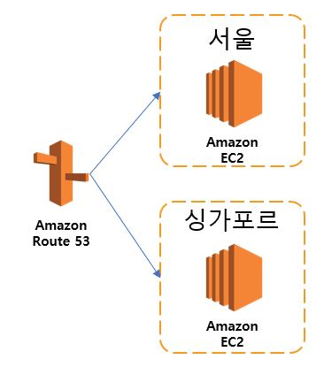
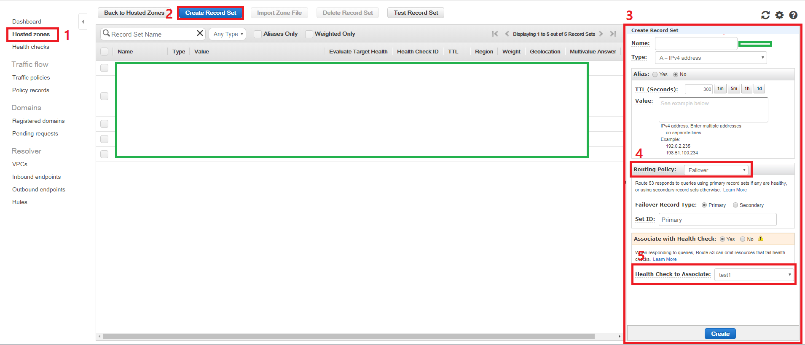

[지난 AWS 장애 관련 글](http://expitly.tistory.com/52)에서 Multi Region이나 Multi Cloud를 언급 했었는데, 이번에 Multi Region 관련 TEST를 해보고 기록으로 남기려고 한다.

이 글에서 Test한 사항은 Multi Region 구성이다.

테스트에서는 Route 53 인스턴스를 활용하여 서울Region의 EC2와 싱가포르Region의 EC2를 ACTIVE-STANDBY 구조로 만들어 보았다.

* 초록색 부분은 개인서버정보 이므로 안전하게 삭제하였다.

Route53 인스턴스에 들어간 후 , 1번 [ **Hosted zones** ] -> 2번 [ **Create Recode Set** ]을 클릭하면 우측 3번과 같은 화면을 볼 수있다. Route53에서는 4번[ **Routing Policy** ]를 설정 할 수 있는 것을 알 수 있다.
Routing Policy 항목으로는 6가지가 있는데 이것들 중 [**Failover**]를 사용할 것이다.

Failover를 선택하면 위 그림과 같이 Failover Recode Type으로 Primary와 Secondary를 선택 할 수 있는데, Primary가 Active가 되고, Secondary가 StandBy가 된다. 즉, Primary에 연결된 IP또는 도메인에 HealthCheck를 하여 문제가 있으면 Secondary로 연결 되는 것이다.

5번[ **Health Check to Associate** ]를 선택하여 앞에서 말한 HealthCheck를 설정 할 수 있는데, 이 정보는 왼쪽 SideMenu 중 [**Health Checks**] 메뉴에서 쉽게 설정 할 수 있다.

테스트에서는 서울 Region EC2 인스턴스를 Primary로 설정하고, 싱가포르 Region EC2 인스턴스를 Secondary로 설정하였다. 그 후, 서울 Region EC2 인스턴스를 내렸을 때, 싱가포르 Region의 EC2 인스턴스로 정상 연결 되는 것을 알 수 있었다. 그 후 다시 서울 Region EC2 인스턴스를 살렸을 때는 다시 서울 Region EC2 인스턴스로 연결되고, 싱가포르 Region 인스턴스는 Standby 상태가 됨을 알 수 있었다. 

이제 서울 Region에서 문제가 발생하여도 싱가포르 Region으로 Switch 될 수 있기 때문에 더 안정적인 서비스가 가능하다!!!!

#### 느낀점 및 주의할 점

일단 Health Check시 TTL을 어느정도 짧게 잡아야한다. 이유는 TTL을 길게 설정하면 Primary 쪽에서 이상이 생겼을 시, 빠르게 Secondary로 전환 될 수 없기 때문이다. AWS에서도 TTL을 60초 이하로 설정 하기를 권장하고있다. 하지만 TTL을 너무 짧게 잡으면 Secondary로의 전환은 빨리 되겠지만, 비용이 더 많이 발생하므로 적절하게 잘 잡아야 한다. 또한, 이렇게 Failover 구성을 할 경우, 싱가포르의 인스턴스는 말 그대로 Standby 상태가 되는 것이다. 즉, 실 서비스에서 전체 구성을 그대로 복사하여 다른 Region에 구성해두는 것인데, 이럴 경우, 비용도 2배가 될 것이다...ㅠ 비용적인 측면과 안정성 측면에서 잘 따져본 후 구성해야 할 것 같다.